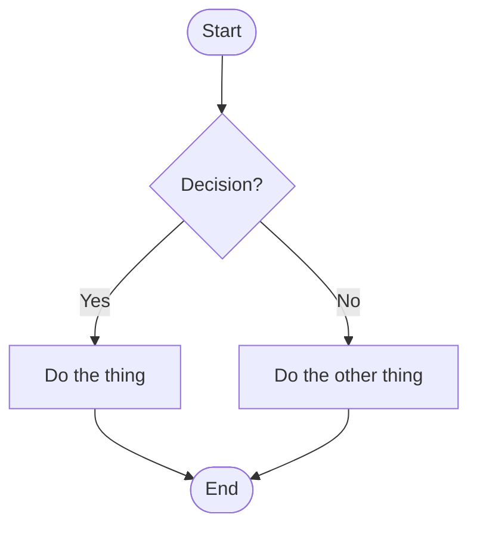
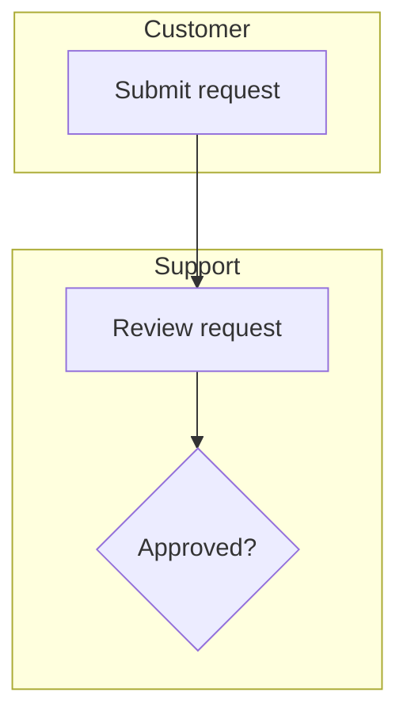

# Mermaid Flowchart Syntax

The `.mmd` file is the **source of truth** — write it first, then generate the `.drawio` copy from
its logical structure (see `drawio-xml-syntax.md` for the copy's mechanics). This file covers the
Mermaid mechanics; `diagram-design-principles.md` covers how to think about structure regardless of
output format.

## File skeleton



`flowchart TD` (top-down) or `flowchart LR` (left-right) — matches the direction choice in
`diagram-design-principles.md` §3. `graph TD` is an older alias for the same thing; always use
`flowchart`, not `graph`, in new files.

## Node shapes — mapped to the same vocabulary as drawio

| Symbol meaning | Mermaid syntax | drawio equivalent (`diagram-design-principles.md` §1) |
|---|---|---|
| Terminator (start/end) | `id([Text])` (stadium) | Ellipse |
| Process / action step | `id[Text]` (rectangle) | Rectangle |
| Decision | `id{Text}` (diamond) | Rhombus |
| Input/Output (data) | `id[/Text/]` or `id[\Text\]` (parallelogram) | Parallelogram |
| Predefined process / subroutine | `id[[Text]]` (double-border) | Predefined process |
| Connector | `id((Text))` (circle) | Small circle |
| Database / stored data | `id[(Text)]` (cylinder) | Cylinder |

Keep the same shape-per-meaning rules as `diagram-design-principles.md` §1 — the mapping exists so
a node's *meaning* survives the round trip between `.mmd` and `.drawio`, not just its label.

## Edges

- Plain: `A --> B`
- Labeled: `A -->|Yes| B` (preferred — keeps the label out of the arrow syntax itself) or
  `A -- Yes --> B` (equivalent, use whichever reads cleaner for a long label)
- Dotted (rare — e.g. an optional/async path): `A -.-> B`
- Loop-back edges just point from a later node back to an earlier one; Mermaid auto-routes them,
  there's no manual geometry to get right the way there is in drawio.

## Swimlanes → subgraphs

For multi-actor diagrams (per `diagram-design-principles.md` §2 step 2), use one `subgraph` per
actor:



Give each subgraph an explicit `direction TB` or `direction LR` line as its first statement if it
needs to differ from the outer diagram's direction.

## Theming

Apply theme colors from `themes.md` via `classDef` + `class`, not inline per-node styling — this
keeps the file scannable and mirrors how a drawio style string carries the same three colors:

```mermaid
classDef default fill:#ffffff,stroke:#2563eb,color:#0f172a;
classDef decision fill:#fef3c7,stroke:#d97706,color:#78350f;
classDef success fill:#dcfce7,stroke:#16a34a,color:#14532d;
classDef error fill:#fee2e2,stroke:#dc2626,color:#7f1d1d;

class decisionNodeId decision
class successNodeId success
class errorNodeId error
```

Nodes with no explicit `class` line pick up `classDef default` automatically. Use the exact same
hex triples as the chosen theme in `themes.md` so the `.mmd` and `.drawio` copies read as the same
diagram in two different editors.

**Edge color**: `linkStyle` targets edges by their 0-based declaration order in the file (the
`default` keyword for "all edges" isn't reliably supported across Mermaid versions — count edges
and list their indices explicitly to be safe):

```mermaid
linkStyle 0,1,2,3,4 stroke:#334155,stroke-width:2px;
```

Recount indices any time you add, remove, or reorder an edge line — a stale index list silently
styles the wrong edge.

## Comments and gotchas

- `%% comment text` for a comment line — never `//` or `#`.
- A node label containing `(`, `)`, `[`, `]`, `{`, `}`, `|`, or `"` breaks the shape-delimiter
  parsing unless quoted: wrap the whole label in `"..."`, e.g. `id["Approve (level 2)"]`.
- Node `id`s must be unique within the file (same rule as drawio `mxCell id`), and are plain
  identifiers — no spaces. Keep them short and stable (`start`, `decision1`, `notifyCustomer`) so
  they're easy to cross-reference against the generated drawio `mxCell id`s during a sync-back.
- One flowchart per `.mmd` file — Mermaid has no multi-page equivalent to a multi-`<diagram>`
  `.drawio` file. A diagram that needs splitting per `diagram-design-principles.md` §3 becomes
  multiple `.mmd` files (and a subroutine node linking them conceptually), not multiple pages in one.
